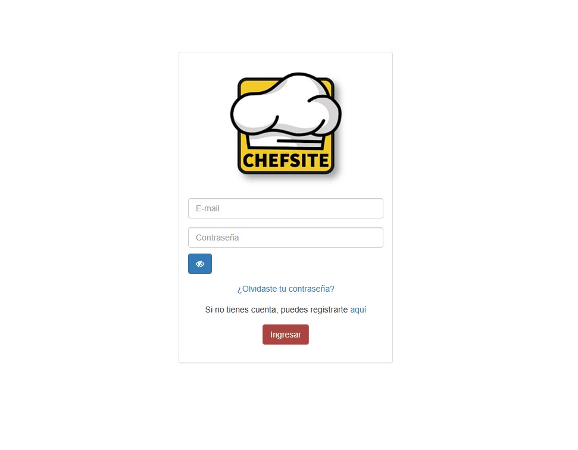
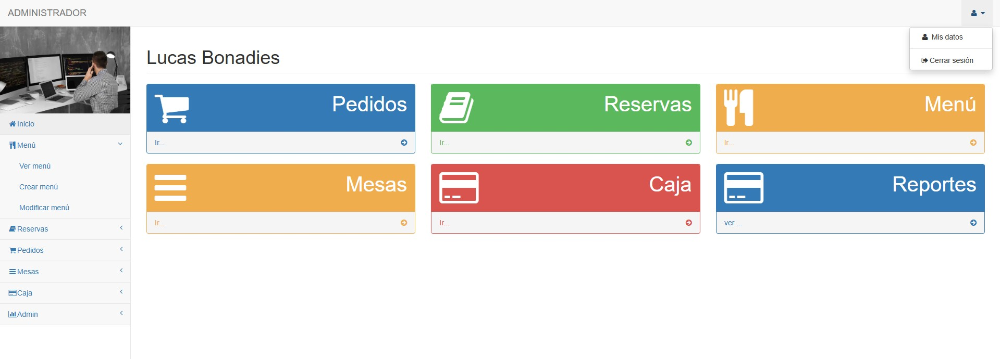
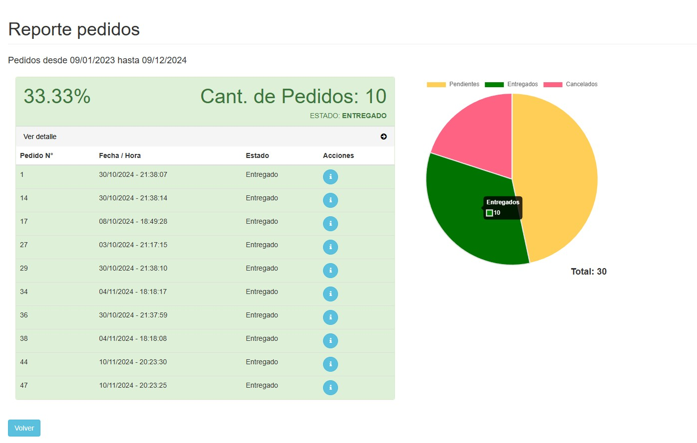
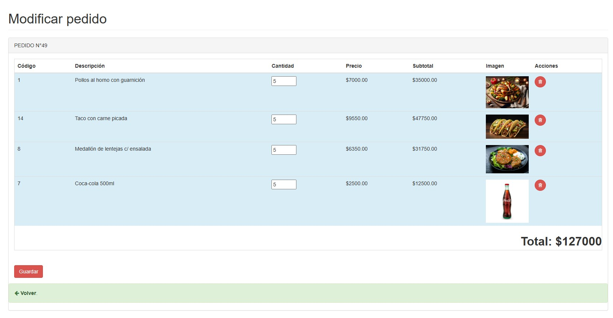
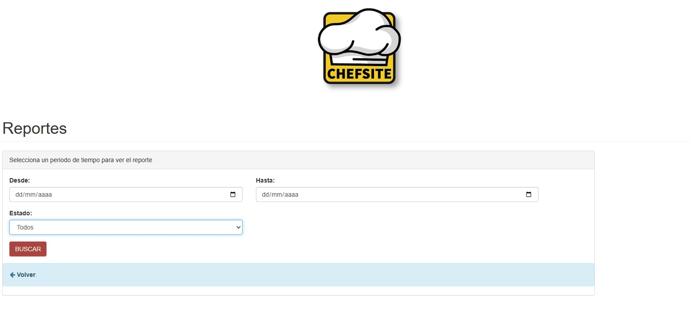

# 🍽️ ChefSite

ChefSite is a web application for comprehensive restaurant management, developed in PHP.
It allows **Customers**, **Employees** (chef, cashier, waiter), and the **Administrator** to interact with the system in real time, optimizing the establishment's processes.

---

### 🌟Features

#### 👥 **Customers**
- Registration and login
- Modification of personal information
- Place orders in real time within the restaurant.
- Reserve tables
- View, modify, and cancel orders
- Pay directly from the web application

#### 👨‍🍳 **Chef**
- Manage the restaurant's menu
- Modify menu content or temporarily remove dishes

#### 🍽️ **Waiter**
- Place orders for customers without an app
- Assign tables to customers.
- View, modify, and cancel orders

#### 💰 **Cashier**
- Process and collect payments

#### 🏢 **Administrator**
- Assign roles and jobs.
- Oversee all system functions.

---

### 🛠 Technologies used

- PHP
- MySQL
- HTML5
- CSS3
- JavaScript
- Bootstrap

---

📸 Screenshots
<table>
<tr>
  <td>
    
  
    
  </td>
  <td>
    
  
  
  </td>
  <td>
    
  
  
  </td>
</tr> 
<tr>
  <td>
    
  
    
  </td>
  <td>
    
  
  
  </td>
  <td>
    
  
  
  </td>
</tr> 
</table>
